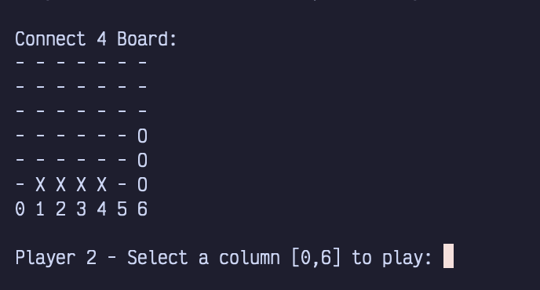
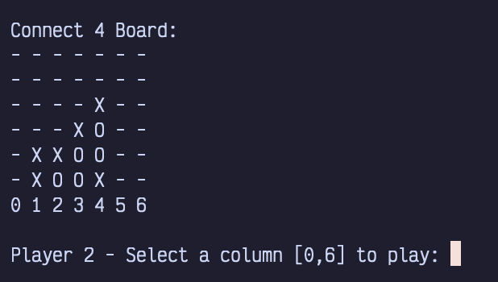
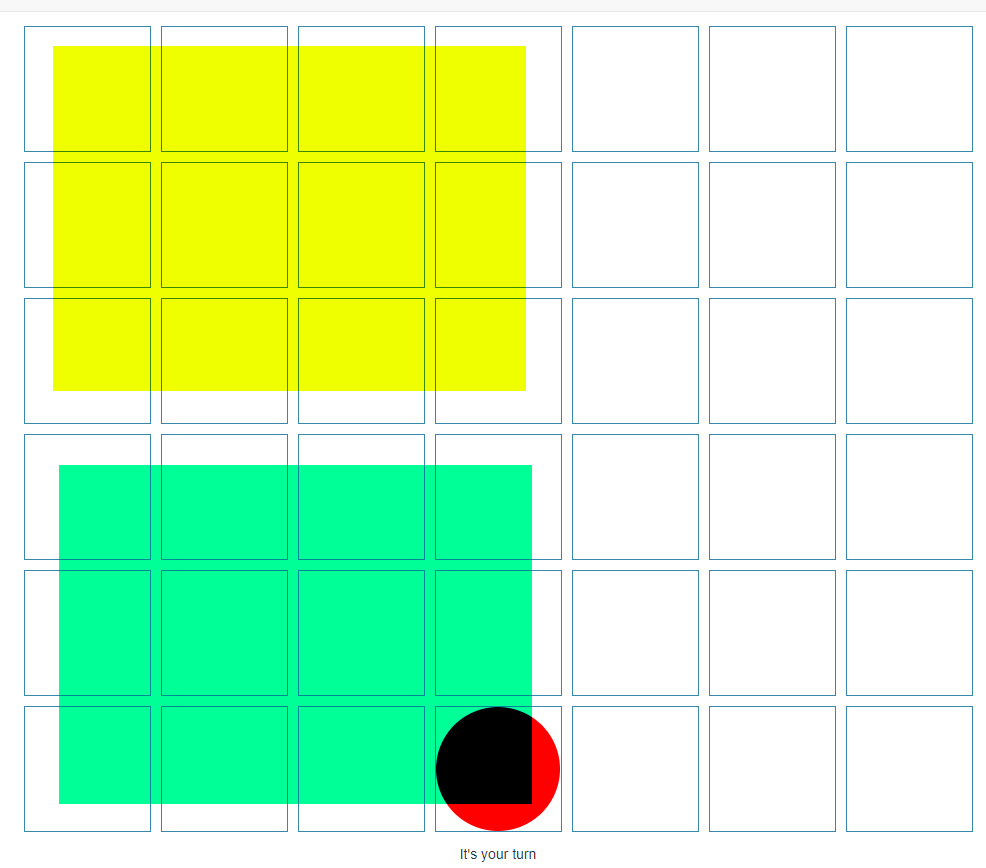

# Lab 7

I can't really do a code demo here, sorry. What I can do, though, is help you out.

## The problem

You have an almost finished Connect 4 program working. It detects if someone has four in a row vertically, but that's... about it. It doesn't detect for four horizontally nor diagonally.



## How to implement it

### Horizontal win
1. Iterate through the row the last piece was played in. (You may have to figure this out yourself.)
2. Check if there are four of that piece, in that row, consecutively. (Set up a counter, like in the vertical win code, to check.)

### Diagonal win
This is a bit harder. Here are my notes from when I played it. 

Before you do that, though, [play a game of Connect 4 online with a friend or something.](https://boardgames.io/en/connect4)



A \/ diagonal win can never have any pieces in the top left corner, but it will always have pieces in the bottom left (coloured in green). At the same time, a \\ diagonal win will never have any pieces in the bottom left corner, but it will always have pieces in the top left (coloured in yellow).

My first year self also had some interesting pseudocode:

```
Pseudocode for both diagonal algorithms:
    1) Check for if any of the tiles are current player's
       within a rectangle of area ROW / 2 * COL / 2 on 
       bottom/top left (shown in image above)
    2) If the tile is the player's, check if the next 3
       in the diagonal direction are also the player's
```
